# Planetary Research Data Pipeline

This repository contains the end-to-end Knowledge Discovery in Databases (KDD) pipeline for predicting exoplanetary habitability using unsupervised machine learning.

## Pipeline Architecture

The complete workflow, from ingesting the raw NASA Exoplanet Archive CSV to the final associative rule mining, is documented below:

```mermaid
graph TD
    %% Base Styles
    classDef section fill:#1f1f2e,stroke:#4d4d73,stroke-width:2px,color:#fff,font-weight:bold;
    classDef step fill:#2d2d44,stroke:#666699,stroke-width:1px,color:#e0e0e0;
    classDef highlight fill:#1b4d3e,stroke:#2e8b57,stroke-width:2px,color:#fff,font-weight:bold;
    classDef output fill:#4d1b1b,stroke:#8b2e2e,stroke-width:1px,color:#ffcccc;

    %% -----------------------------------------------------------------
    %% SECTION 1: LOAD & PREPROCESS
    %% -----------------------------------------------------------------
    subgraph S1 [SECTION 1 to 3: INGESTION & DATA CLEANING]
        A[Load Raw NASA CSV Archive] --> B[Filter default_flag == 1]
        B --> C[Isolate 17 Core Features]
        C --> D[Chen & Kipping Imputation<br/>Radii <--> Mass Mappings]
        D --> E[Thermal Rectification<br/>Fix pl_eqt using pl_insol]
        E --> F[KNN Imputer<br/>Fill remaining NaNs]
        F --> G[StandardScaler<br/>Normalize Feature Matrix]
    end
    class S1 section;
    class A,B,C,D,E,F,G step;

    %% -----------------------------------------------------------------
    %% UNSUPERVISED CLUSTERING
    %% -----------------------------------------------------------------
    subgraph S2 [SECTIONS 4 to 6: MULTI-STAGED UNSUPERVISED CLUSTERING]
        G --> H[Z-Score Outlier Removal<br/>Set aside absolute values where z > 4.5]
        H --> I[Clean Dataset]
        H --> J[Extreme Outliers Box]
        
        I --> K[PCA Dimensionality Reduction<br/>Retain 85% variance]
        
        K --> L[K-Means Clustering<br/>k=5 on PCA Space]
        K --> M[Hierarchical Agglomerative<br/>Ward Linkage on PCA Space]
        
        J --> N[Post-hoc Assignment<br/>Map outliers to closest centroid]
        L --> N
        M --> N
        
        N --> O[Identify Earth-like Cluster<br/>Centroid closest to Earth baseline]
        O --> P[Isolate Earth-like Candidates]
        
        P --> Q[DBSCAN Sub-Clustering<br/>eps=0.6, min_samples=5 on Core 3 Features]
        Q --> R[Filter out DBSCAN Noise]
        Q --> S[Dense Sub-clusters identified]
    end
    class S2 section;
    class H,I,J,K,L,M,N,O,P,Q,R,S step;

    %% -----------------------------------------------------------------
    %% SCORING & FILTERING
    %% -----------------------------------------------------------------
    subgraph S3 [SECTION 7: HABITABILITY SCORING & FILTERING]
        S --> T[Kopparapu Habitable Zone Boundary Check<br/>Recent Venus to Early Mars limits]
        T --> U[Calculate Earth Similarity Index ESI<br/>Weighted Geometric Mean of R, rho, vesc, T]
        U --> V{Target Planet Recovery Check<br/>Are all 20 target planets present?}
        V -->|Yes| W[Generate Final Habitable Candidates DataFrame]
    end
    class S3 section;
    class T,U,V step;
    class W highlight;

    %% -----------------------------------------------------------------
    %% DOWNSTREAM ANALYSIS
    %% -----------------------------------------------------------------
    subgraph S4 [SECTIONS 8 to 11: DOWNSTREAM ANALYTICS & ARMs]
        W --> X[Isolation Forest Outlier Benchmarking]
        
        W --> Y[Classification Pipeline<br/>Label positive targets via score percentile]
        Y --> Z[SMOTE Class Balancing<br/>k_neighbors = 5]
        Z --> AA[Train Decision Tree Classifier]
        Z --> AB[Train Gaussian Naive Bayes Classifier]
        
        W --> AC[Categorical Binning<br/>Convert continuous metrics to discrete bins]
        AC --> AD[Apriori Rule Mining<br/>Filter with Habitable as Consequent]
    end
    class S4 section;
    class X,Y,Z,AA,AB,AC,AD step;

    %% -----------------------------------------------------------------
    %% TERMINAL VISUALIZATIONS
    %% -----------------------------------------------------------------
    subgraph S5 [SECTION 12: EXECUTION & FILE OUTPUTS]
        X & AA & AB & AD --> AE[Save Diagnostic Suite<br/>27 Plots exported to Local Directory]
    end
    class S5 section;
    class AE output;
```

